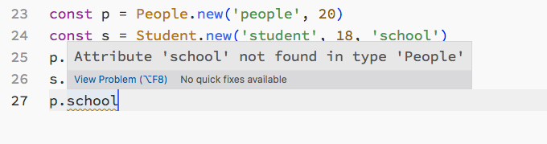

*画面显示异常是由于录制软件压缩损失导致*

# 代码编辑器

一款正在开发中的代码编辑器，目前支持基本的代码编辑、光标移动、代码补全、语法高亮，并且支持上百万行代码的大文件流畅编辑

使用 python 和 c++ 从 0 进行开发：

1. c++ 负责实现底层的渲染引擎，所有 ui 元素都是通过 OpenGL 自行绘制，包括字体的渲染（freetype），没有使用任何的第三方 c++ ui 库（qt、gtk 等）
2. 编辑器的业务逻辑后端也是通过 c++ 实现
3. python 通过调用 c++ 提供的各种基础设施来开发编辑器的 ui 前端界面
4. 同时在 python 端开发了一个类 React 的声明式 UI 框架，便于编辑器的前端开发
5. 采用实时热更新的开发模式，开发过程无须频繁的重新运行程序

## 自动补全窗口

## 多光标操作

## 大文件

## 类 React 声明式 UI 框架

## 实时 UI 热更新开发

https://github.com/3examan/screenshots/assets/79451373/239d79f4-515a-4de1-9fca-d431f701cce6

# 自制编程语言

一款面向对象的动态语言，采用 C 语言实现，手写递归下降的语法解析器 Parser，并用该语言开发了一款小游戏，而且给该语言写了一个 vscode 的 lsp 后端 ide 插件

## Sanlang

## 使用 Sanlang 开发的一款小游戏

# ide

给 Sanlang 做的一款 lsp 后端 ide 插件，支持语义级别的代码补全、代码跳转、语法语义错误提示

## 智能补全

## 语义错误提示

## 代码跳转

### 跨文件跳转

### 引用跳转
